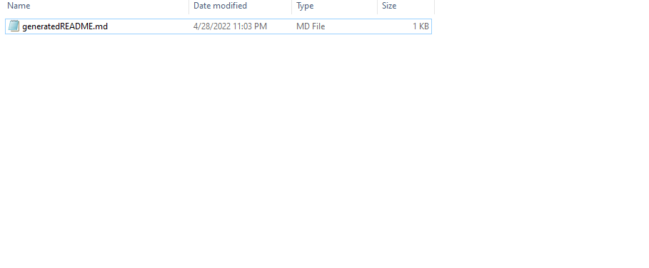

# README Generator

## Need a professional README quick for your project? Use this README Generator application!

<br>
Developed as a challenge for the Rutgers Coding Bootcamp, this application uses JavaScript and Node.js
<br>
<br>

## Usage


This is a command-line application. First download the files and navigate to where you downloaded them on your CLI.

Once in the project folder, run this command to install required dependencies:

```
npm install
```
or
```
npm i
```

To run the application, change directory into the "Develop" folder, and type this command into the command line:

```
node index
```
The application will give you a series of questions about information for your README


<br>
<br>

### Once all questions have been answered, the application will generate your professional README into the "generated" folder!
<br>
<br>


<br>
<br>
